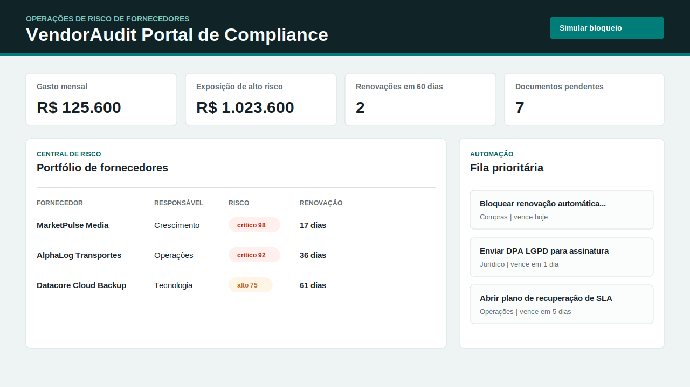

# VendorAudit - Portal de Conformidade

VendorAudit é um portal web pronto para portfólio, voltado a risco de fornecedores, documentos de conformidade, acompanhamento de SLA, governança de renovações e automação de compras.

O caso comercial é direto: empresas que pagam múltiplos fornecedores precisam de visibilidade antes de contratos renovarem automaticamente, pagamentos serem liberados ou falhas de conformidade virarem risco operacional. O projeto demonstra um painel B2B que pode ser adaptado para times de compras, financeiro, jurídico ou operações.



## Valor Comercial

- Ajuda compras a bloquear renovações arriscadas antes da renovação automática.
- Dá ao financeiro uma visão clara da exposição contratual de alto risco e do gasto mensal com fornecedores.
- Ajuda jurídico e conformidade a acompanhar documentos ausentes, como certidão fiscal, seguro, DPA LGPD e declaração anticorrupção.
- Cria uma fila automática de tarefas para responsáveis por fornecedores, reduzindo dependência de planilhas.
- Demonstra projeto de API, modelagem de regra de negócio, interface de painel, dados de exemplo e empacotamento para publicação sem serviços externos.

## Funcionalidades

- Pontuação de risco por fornecedor baseada em criticidade, documentos ausentes, diferenças de SLA, incidentes, auditorias antigas, proximidade de renovação e exposição financeira.
- KPIs executivos para gasto mensal, valor anual contratado, exposição de alto risco, renovações e pendências de conformidade.
- Painel de portfólio de fornecedores ordenado por risco calculado.
- Agenda de renovação para contratos dos próximos 120 dias.
- Matriz de conformidade com status dos documentos obrigatórios por fornecedor.
- Fila de automação que combina tarefas manuais e ações geradas para conformidade, SLA e auditoria.
- Simulação de bloqueio de renovação que estima valor contratual protegido.
- Interface responsiva com dados comerciais realistas.
- Testes de API, regras de negócio e smoke test usando Node.js nativo.

## Stack

- Servidor HTTP nativo em Node.js
- JavaScript com ES modules
- Interface em HTML e CSS
- `node:test` nativo
- Dados de exemplo em JSON
- Dockerfile para empacotamento e publicação

## Execução Local

Requer Node.js 24+.

```bash
npm install
npm run check
npm test
npm run smoke
npm start
```

Abra:

```txt
http://127.0.0.1:4182
```

Nenhum banco de dados é necessário para a demonstração. Os dados de exemplo são carregados de `data/seed.json`.

## Visão Geral da API

| Método | Endpoint | Finalidade |
| --- | --- | --- |
| GET | `/api/health` | Saúde do serviço |
| GET | `/api/summary` | KPIs executivos de fornecedores |
| GET | `/api/vendors` | Portfólio de fornecedores com pontuação de risco |
| GET | `/api/risk-breakdown` | Contagem de fornecedores por nível de risco |
| GET | `/api/renewals` | Agenda de renovação dos próximos 120 dias |
| GET | `/api/compliance-matrix` | Status de documentos de conformidade por fornecedor |
| GET | `/api/automation-queue` | Fila de ações manuais e geradas |
| POST | `/api/simulate/renewal-hold` | Estima renovações bloqueadas e valor protegido |

As notas completas dos endpoints estão em [`docs/api-endpoints.md`](docs/api-endpoints.md).

## Exemplos de Regras de Negócio

- Documentos de conformidade ausentes ou vencidos aumentam o risco do fornecedor.
- Contratos que renovam dentro da janela de política disparam revisão de compras.
- Fornecedores críticos com SLA fraco exigem plano de recuperação.
- Auditorias antigas geram trabalho de acompanhamento para compras.
- Renovações arriscadas com gaps documentais são bloqueadas na simulação.

## Publicação

### Docker

```bash
docker build -t vendoraudit-compliance-portal .
docker run --rm -p 4182:4182 vendoraudit-compliance-portal
```

### Render, Railway or Fly.io

Use estas configurações:

- Comando de build: `npm install`
- Comando de start: `npm start`
- Versão do Node: `24`
- Porta: `4182` ou a variável `PORT` fornecida pela plataforma

O app lê `process.env.PORT`, então roda na maioria das plataformas compatíveis com Node.

## Notas de Portfólio

Este projeto foi moldado para propostas freelance:

- Resolve um problema operacional concreto com ROI claro.
- Inclui dados realistas e lógica de decisão visível.
- Expõe endpoints que podem se conectar a ERP, compras, contabilidade ou sistemas documentais.
- Pode evoluir para acesso por perfil, upload de arquivos, workflow de aprovação, lembretes por e-mail ou auditorias agendadas de fornecedores.

## Melhorias Possíveis

- Adicionar autenticação e permissões por perfil para compras, financeiro e jurídico.
- Persistir fornecedores e tarefas em PostgreSQL ou SQLite.
- Adicionar upload de documentos com lembretes de vencimento.
- Integrar webhooks/e-mail para responsáveis por fornecedores.
- Adicionar importação CSV a partir de exportações de ERP.
- Criar workflow de aprovação para exceções de renovação.
